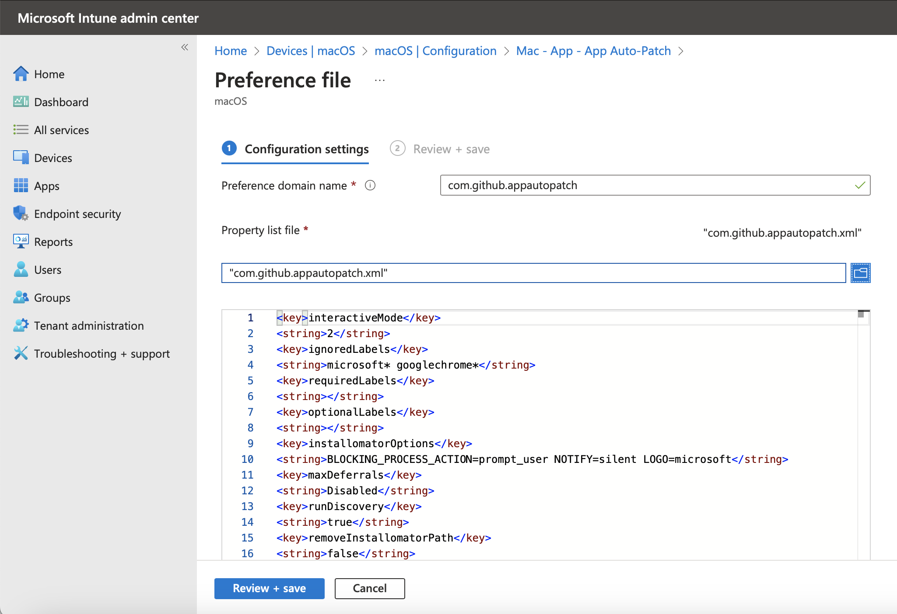
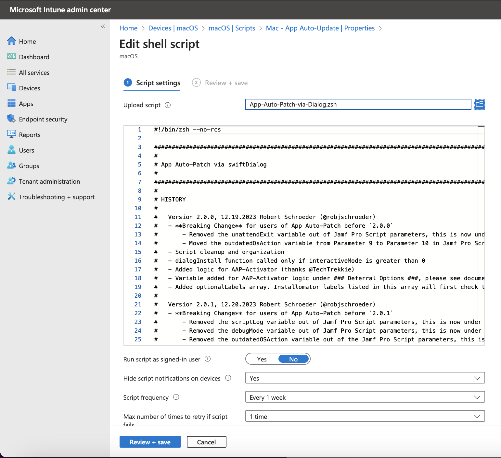

## App Auto-Patch setup in Intune

### Required Steps:
- Edit the XML configuration file to match your desired settings
- Upload the configuration file (See details below on how to do this)
- Upload the App-AutoPatch Script

 
 
### Step Details:

- #### Edit the XML Preference File

Use your favorite text editor to adjust the key values in the XML file. Details of the script variables are available on the App Auto-Patch Wiki:
[https://github.com/App-Auto-Patch/App-Auto-Patch/wiki](https://github.com/App-Auto-Patch/App-Auto-Patch/wiki)

You can omit any of the undefined keys. The value will be the default embedded in the script. Which in some cases is also just blank.

- #### Upload the Preference File Settings

Preference File settings can be managed in Intune using the **Templates** -> **Preference File** configuration.  

Click the **Create** -> **New Policy** button.  

* For Profile type, select **Templates**, then select **Preference File** from the list. Then click the **Create** button.  
* Name your profile using a preferred naming standard and then click **Next**.  
* Specify the **Preference domain name**, it is important to match the exact name. (com.github.appautopatch) Letter case matters here.  
* Select the XML preference file you want to use and click the **Next** button.  
* Assign the profile to your appropriate device or user group.  
  
  
  
##### Intune Templates -> Preference File import example:  
    
  
- #### Upload App Auto-Patch Script File

Script can be managed in Intune by navigating to **Devices** -> **macOS** -> **Scripts**

Click the **Add** button.  

* Name your script using a preferred naming standard and then click **Next**.
* Set **Run script as signed-in user**, to **No**.
* Set **Hide script notifications on devices**, to **Yes**.
* Set **Script frequency**, to **Your desired interval. Weekly seems about right?**.
* Set **Max number of times to retry if script fails**, to **Your desired retry value.**.
* Click the **Upload script** button. Select the script file you want to use.  
* Assign the Script to your appropriate device or user group.  
  
  
  
##### Intune Script import example:  
    
    
      
#### Plist Notes:  
The XML files are essentially just macOS plist files with the, opening and closing key tags removed.  

Opening keys:  
`<?xml version="1.0" encoding="UTF-8"?>`  
`<!DOCTYPE plist PUBLIC "-//Apple//DTD PLIST 1.0//EN" "http://www.apple.com/DTDs/PropertyList-1.0.dtd">`  
`<plist version="1.0">`  
`<dict>`  

  
Closing keys:  
`</dict>`  
`</plist>`  
    
For all practical purposes, you can open a standard xml plist file and remove those sections and use it in Intune. I'm really not sure why Microsoft decided not to just support standard plist files. It really would have been easier for everyone. :-)

Important Note: If the plist file is in binary format, you need to convert it to xml format to use it with Intune.  
`plutil -convert xml1 /path/to/plist_file.plist`
  
  
  
#### Intune documentation on working with preference files:  
[https://learn.microsoft.com/en-us/mem/intune/configuration/preference-file-settings-macos](https://learn.microsoft.com/en-us/mem/intune/configuration/preference-file-settings-macos)
