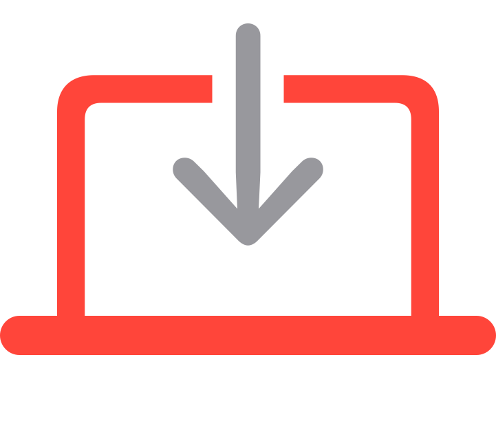

<!-- markdownlint-disable-next-line first-line-heading no-inline-html -->

# App Auto-Patch 3.2.2

    

## Introduction
App Auto-Patch combines local application discovery, an Installomator integration, and user-friendly swiftDialog prompts to automate application patch management across Mac computers.

## Why Build This

App Auto-Patch was developed based on a similar concept as the Patchomator project, with a significant portion of its code borrowed from there. The main requirement for its use was to create a script deployable through Jamf Pro without the need for installing multiple dependencies on end-user computers. Since the original concept, it has since become an independent repository hosted here.

The script simplifies the process of taking an inventory of installed applications and patching them, eliminating the need for creating multiple Smart Groups, Policies, Patch Management Titles, etc., within Jamf Pro. It provides an easy solution for keeping end-users' applications updated with minimal effort.

This project has since been applied to MDMs outside of Jamf Pro, showcasing its versatility and adaptability. 

## New features/Specific Changes in 3.2
 - Added [multi-language support](https://github.com/App-Auto-Patch/App-Auto-Patch/wiki/User-Interface-%7C-Multi%E2%80%90Language-Support): Entries can be added to the managed configuration profile for multiple languages, based on the setting for the user in macOS
 - Added [--workflow-install-now-silent](https://github.com/App-Auto-Patch/App-Auto-Patch/wiki/Workflows#workflow-install-now-silent-version-32) option which runs through the workflow without deferrals but does not display dialogs
 - Added option to [disable Installomator Updates](https://github.com/App-Auto-Patch/App-Auto-Patch/wiki/Installomator-Integration#installomator-update-disable) using <key>InstallomatorUpdateDisable</key> <string>TRUE,FALSE</string>
 - Added dialogTargetVersion and set to version 2.5.5 as minimum required due to issues with the deferral menu on older versions

## Getting Started with 3.2

App Auto-Patch 3.2 automatically installs itself and necessary components anytime it's ran from outside the working folder `/Library/Management/AppAutoPatch/`
For more information on getting started and testing, please visit the [AAP 3.2.2 Wiki](https://github.com/App-Auto-Patch/App-Auto-Patch/wiki) page for more information

- After installed, you can simply run `sudo appautopatch` from terminal with any parameters to configure as you'd like. Examples:

`sudo appautopatch --interactiveMode=2 --workflow-install-now --deadline-count-focus=2 --deadline-count-hard=4 --ignored-labels="microsoft* googlechrome* jamfconnect zoom* 1password* firefox* swiftdialog" --verbose-mode`

Or trigger from the script directly to perform an install with parameters as you'd like. Example:

`./App-Auto-Patch-via-Dialog.zsh --interactiveMode=2 --workflow-install-now --deadline-count-focus=2 --deadline-count-hard=4 --ignored-labels="microsoft* googlechrome* jamfconnect zoom* 1password* firefox* swiftdialog" --verbose-mode`

 - You can find a mapping of 2.x variables to 3.2.2 configuration and command line options from the following TSV file: [Migration Options](https://github.com/App-Auto-Patch/App-Auto-Patch/blob/3.0/Resources/App-Auto-Patch%203.0.0-Migration-Options.tsv)
 - Profile Manfiests to assist with building a configuration profile can be found in the Resources folder: [Profile Manifests](https://github.com/App-Auto-Patch/App-Auto-Patch/tree/main/Resources/Manifests)
 - An example configuration profile and a profile & plist containing All available options can be found in the resources: [Example Configurations](https://github.com/App-Auto-Patch/App-Auto-Patch/tree/main/Resources)

- To reset AAP to defaults:
  `./App-Auto-Patch-via-Dialog.zsh --reset-defaults`

- Clear Ignored, Required, and Optional Labels:
  `./App-Auto-Patch-via-Dialog.zsh --reset-labels`

- Uninstall App Auto Patch:
  `./App-Auto-Patch-via-Dialog.zsh --uninstall`

## Learn More 

Please review the wiki: [App Auto-Patch Wiki](https://github.com/App-Auto-Patch/App-Auto-Patch/wiki)

- [Getting Started](https://github.com/App-Auto-Patch/App-Auto-Patch/wiki/Getting-Started)

- [Deferral Behavior](https://github.com/App-Auto-Patch/App-Auto-Patch/wiki/Deferral-Behavior)

- [Configuration Settings](https://github.com/App-Auto-Patch/App-Auto-Patch/wiki/Configure-Settings)

***

You can also join the conversation at the [Mac Admins Foundation Slack](https://www.macadmins.org) in channel [#app-auto-patch](https://macadmins.slack.com/archives/C05D69E7SBH).

## Thank you
To everyone who has helped contribute to App Auto-Patch, including but not limited to:

- Robert Schroeder ([@robjschroeder](https://github.com/robjschroeder))
- Andrew Spokes ([@TechTrekkie](https://github.com/TechTrekkie))
- Dan Snelson ([@dan-snelson](https://github.com/dan-snelson))
- Andrew Clark ([@drtaru](https://github.com/drtaru))
- Andrew Barnett ([@andrewmbarnett](https://github.com/AndrewMBarnett))
- Trevor Sysock ([@bigmacadmin](https://github.com/bigmacadmin))
- Bart Reardon ([@bartreardon](https://github.com/bartreardon))
- Charles Mangin ([@option8](https://github.com/option8))
- Gil Burns ([@gilburns](https://github.com/gilburns))
### And special thanks to the Installomator Team
- Armin Briegel ([@scriptingosx](https://github.com/scriptingosx))
- Isaac Ordonez ([@issacatmann](https://github.com/issacatmann))
- Søren Theilgaard ([@Theile](https://github.com/Theile))
- Adam Codega ([@acodega](https://github.com/acodega))
